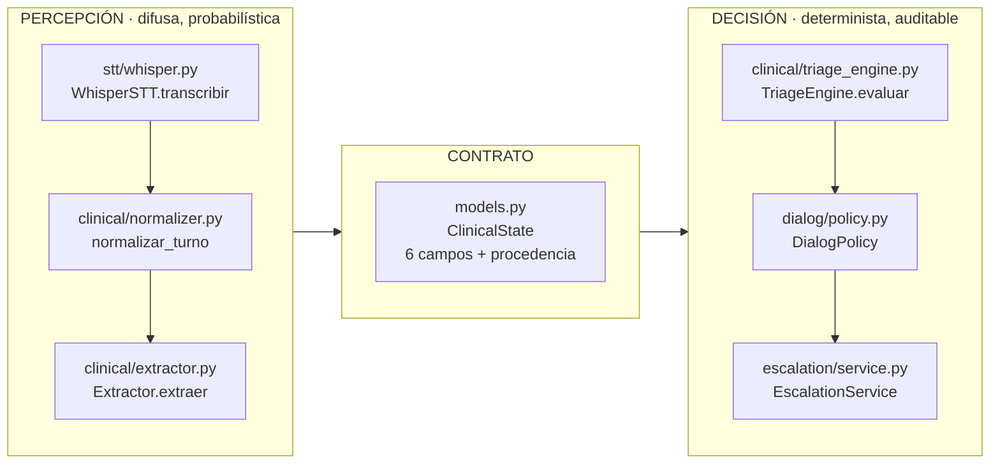
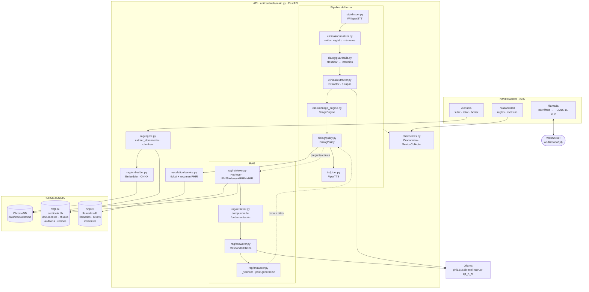
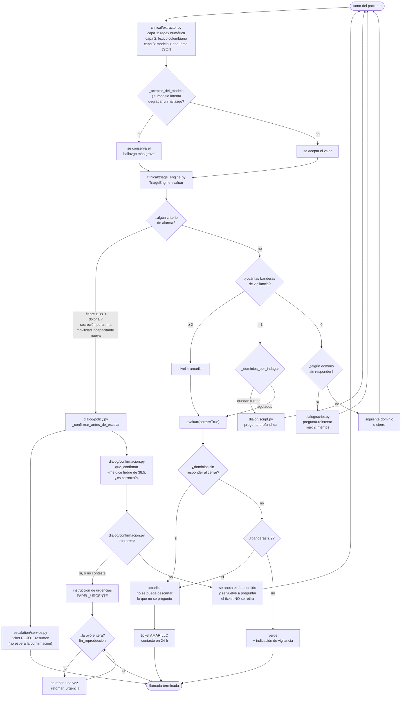
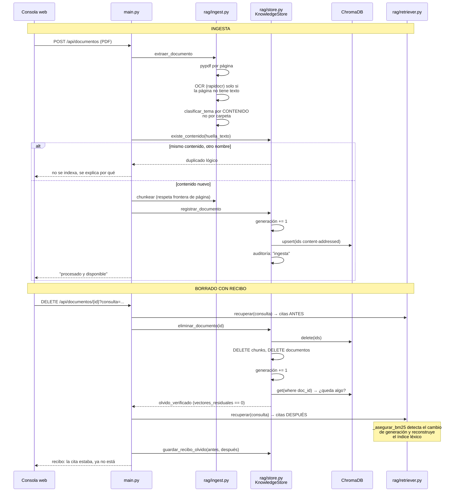
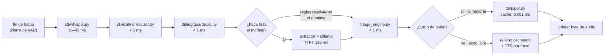
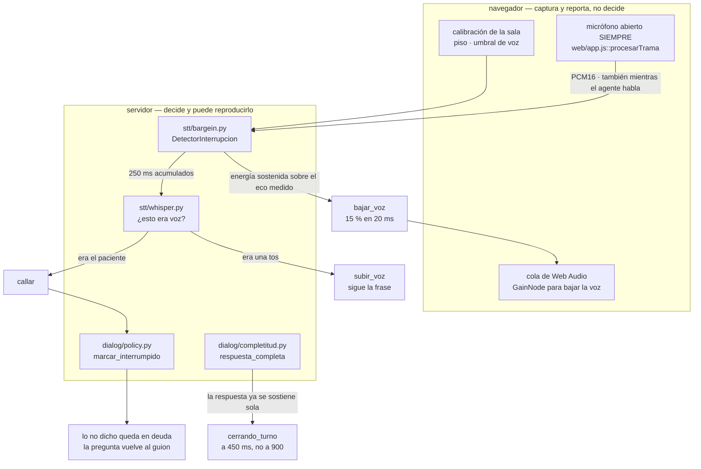
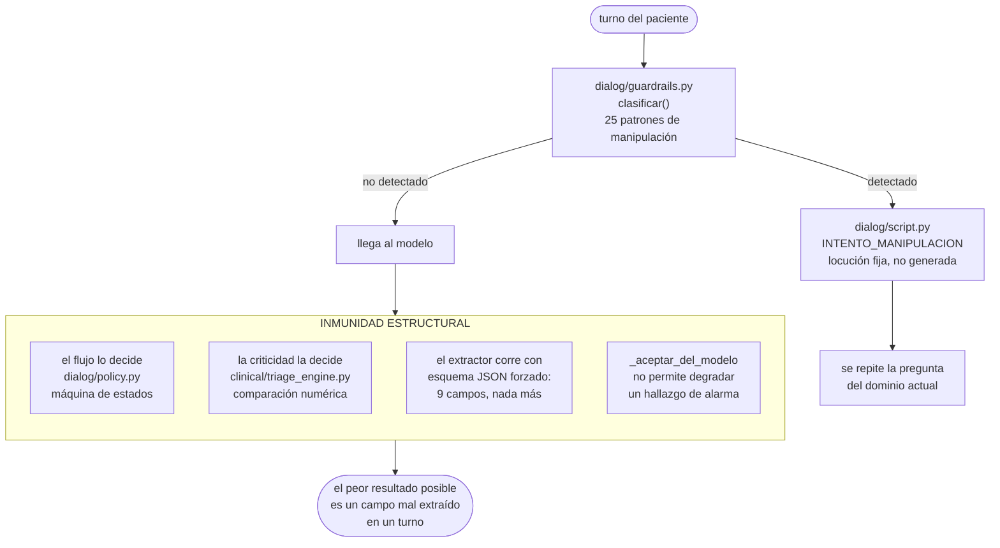

# Arquitectura de Centinela

> **Nota sobre este documento.** La rúbrica dice que *"el jurado toma elementos del
> diagrama al azar y los busca en el código"*. Por eso cada nodo de los diagramas lleva
> el nombre exacto del módulo o de la función que lo implementa, con su ruta. No hay
> ningún elemento en estos diagramas que no exista en el repositorio, y
> `scripts/verificar_diagrama.py` lo comprueba automáticamente.

---

## 1. La decisión de diseño que gobierna todo

> **El modelo percibe. El código decide.**

Un modelo de 3.8 B de parámetros corriendo cuantizado en una laptop no es un componente
al que se le pueda confiar la pregunta *"¿este paciente se está complicando?"*. Pero sí
es bueno en la tarea que tiene delante: convertir *"me duele como aquí abajito de la
axila hace como 20 minutos"* en datos con tipo.

Así que el agente está partido en dos mitades con responsabilidades separadas y un
contrato explícito entre ellas —`ClinicalState`, en `api/centinela/models.py`—:

Consecuencias que la rúbrica evalúa de forma directa:

| Propiedad | Por qué se obtiene |
|---|---|
| No alucina la decisión | No hay nada que muestrear: `triage_engine.py` compara números |
| Inmune a inyección de prompt | Ninguna frase convence a `fiebre >= 38.0` de ser falso |
| Reproducible | Sin aleatoriedad: `make eval` da el mismo resultado siempre |
| Auditable | Cada decisión lista la regla, el valor observado y el umbral |
| Baja latencia | Un flujo predecible permite pre-sintetizar el audio |

---

## 2. Arquitectura completa

### Qué toca el modelo de lenguaje, y qué no

El modelo se invoca en **exactamente dos lugares**:

| Lugar | Módulo | Salida | Restricción |
|---|---|---|---|
| Extracción clínica | `clinical/extractor.py` | JSON de 9 campos | Esquema JSON forzado; no puede emitir otra cosa |
| Respuesta a pregunta clínica | `rag/answerer.py` | 2 frases | Solo si la compuerta de fundamentación dejó pasar; verificada después |

No se invoca para: elegir la siguiente pregunta, decidir la criticidad, decidir si
escalar, redactar las locuciones del guion, ni decidir si un turno es un intento de
manipulación.

---

## 3. Flujo de decisión del agente

### La asimetría clínica, hecha explícita

La rúbrica dice que *"el falso negativo —no alertar cuando había que alertar— es la falla
catastrófica"*. En el diagrama eso son tres ramas concretas:

1. **`= 1` bandera → indagar, no decidir.** Una bandera aislada no escala, pero tampoco
   se ignora: se profundiza en ese dominio buscando una segunda.
2. **Dominio sin responder al cerrar → amarillo.** No se puede descartar lo que nunca se
   llegó a preguntar. Tratar un desconocido como normal es el mecanismo típico del falso
   negativo.
3. **El modelo no puede degradar un hallazgo.** Si las reglas leyeron "líquido amarillo"
   y el modelo dice "normal", gana la regla.

Sobre los 160 casos oficiales, este flujo da **cero falsos negativos clínicos** con un
5 % de sobre-escalamiento. La dirección del error es deliberada.

---

## 4. Conocimiento vivo y olvido demostrable

**Por qué el contador de generación es necesario y no decorativo.** El índice léxico BM25
se construye en memoria a partir de los chunks activos. Sin el contador, un borrado
dejaría el BM25 anterior en pie y el agente seguiría citando un documento que ya no
existe. `Retriever._asegurar_bm25` compara la generación en cada consulta y reconstruye
cuando cambió.

---

## 5. Presupuesto de latencia

Tres decisiones que sostienen el presupuesto:

1. **Caché pre-renderizado.** El guion son 35 locuciones conocidas antes de que suene el
   teléfono (`dialog/script.py::todas_las_locuciones`). `PiperTTS.pre_renderizar` las
   sintetiza al arrancar; en un turno de guion, "sintetizar" es leer un archivo.
2. **El modelo solo cuando hace falta.** Si la regex extrajo el dolor y el léxico
   resolvió la herida, no se invoca el modelo. Medido en la prueba de humo: **90 % de los
   turnos se sirven desde caché de audio**.
3. **TTS por frase en el texto libre.** El paciente oye la primera frase mientras la
   segunda todavía no existe. Medido: 38 % menos de espera hasta el primer audio.

Voz elegida con datos, no por timbre (`scripts/bench_voces.py`): `es_MX-ald-medium`, RTF
0.352. La variante `high` de la misma familia da RTF 0.983 —generar cuesta lo mismo que
dura— y quedó descartada.

---

## 5b. Turnarse como en una llamada

Dos cosas separan una llamada de un walkie-talkie: se puede cortar al otro, y no hay que
esperar a que se haga el silencio para que conteste. Las dos se deciden en el servidor.

**La decisión vive en el servidor, y no es preferencia de estilo.** El registro clínico
tiene que poder afirmar *qué oyó el paciente* —una pregunta cortada es una pregunta no
hecha, y eso cambia el cierre—, así que no puede depender de lo que declare un navegador.
Y una decisión escrita en JavaScript no se puede reproducir contra audio grabado: el
detector que corre en la llamada es el mismo que `eval/bargein.py` alimenta con 53
locuciones reales del agente y 18 grabaciones de voz humana.

**El umbral lo pone el eco, no una constante.** Mientras el agente habla, lo que el
micrófono oye *es* el eco residual que la cancelación del navegador no quitó. Eso no es un
estorbo: es una medida gratis del piso contra el que hay que discriminar. Con auriculares
basta un susurro; con el altavoz alto hay que hablar más fuerte, que es lo que una persona
hace en esa situación. Antes había un umbral fijo de 0.075 medido en una sola sala.

**La energía sospecha; la transcripción confirma.** Un portazo cruza cualquier umbral de
energía, así que el detector no decide interrumpir: decide *bajar la voz*. La confirmación
la da el STT sobre el audio acumulado, con las mismas puertas de calidad que ya filtran las
alucinaciones de Whisper. Un falso positivo cuesta un bache de 250 ms; un corte falso
costaría un turno. Medido en `make bargein`: **0 cortes falsos** a cualquier nivel de eco.

**El bucle de recepción no hace trabajo que tarde.** Antes procesaba el turno con un
`await` dentro del bucle de `ws.receive()`, así que mientras el pipeline trabajaba nadie
leía el socket: un aviso de interrupción se habría atendido cuando ya no servía. Ahora todo
lo lento corre como tarea (`CanalLlamada`) y el bucle solo reparte. Sin eso no hay barge-in
posible, por bueno que sea el detector.

---

## 6. Defensa contra inyección de prompt

Dos capas, y la importante es la segunda.

La capa 1 por sí sola sería frágil: siempre hay un fraseo que la expresión regular no
cubre. Lo que hace que no importe es que **una inyección exitosa contra el modelo no tiene
nada que lograr**: no hay canal por donde emitir una instrucción, no controla el flujo, y
no toca la decisión.

Medido en `eval/redteam.py`: 33 casos adversariales, incluida la familia
`degradar_hallazgo` que intenta retirar una bandera roja ya detectada.

---

## 7. Módulos y responsabilidades

| Módulo | Responsabilidad | No hace |
|---|---|---|
| `models.py` | Tipos del dominio; contrato percepción→decisión | Lógica |
| `clinical/normalizer.py` | Ruido de canal, registro del hablante, números por regla | Decidir |
| `clinical/extractor.py` | Habla → `ClinicalState` en 3 capas | Decidir criticidad |
| `clinical/thresholds.py` | Umbrales + consulta que resuelve su cita | Evaluar |
| `clinical/triage_engine.py` | **La decisión clínica** | Invocar el modelo |
| `clinical/tendencia.py` | Salto entre llamadas del mismo paciente, como bandera amarilla | Decidir sin historia |
| `dialog/script.py` | Guion canónico; fuente del caché de audio | Decidir el flujo |
| `dialog/policy.py` | **Conducir la llamada**; interrupción por bandera roja | Extraer datos |
| `dialog/guardrails.py` | Intención del turno; detección de manipulación | Responder |
| `dialog/confirmacion.py` | Qué leerle de vuelta al paciente y cómo interpretar su sí o su no | Decidir si se escala |
| `dialog/completitud.py` | Si el turno del paciente ya se sostiene solo, para cerrarlo antes | Transcribir |
| `rag/ingest.py` | PDF → chunks; OCR selectivo; tema por contenido | Recuperar |
| `rag/store.py` | Persistencia, tombstones, generación, recibos de olvido | Rankear |
| `rag/embedder.py` | Embeddings ONNX con prefijos E5 | Todo lo demás |
| `rag/retriever.py` | Recuperación híbrida + compuerta de fundamentación | Generar texto |
| `rag/answerer.py` | Respuesta clínica + verificación post-generación | Decidir criticidad |
| `escalation/service.py` | Ticket persistente, resumen con forma FHIR, historial y acuse | Decidir |
| `escalation/despacho.py` | Sacar la alerta del proceso, con reintentos y sin duplicar | Decidir a quién avisar |
| `stt/whisper.py` | Transcripción | Interpretar |
| `tts/piper.py` | Síntesis + caché pre-renderizado; nivelado y cadencia del audio | Elegir qué decir |
| `tts/clon.py` | La voz clonada, leída de disco antes de sintetizar. Caché direccionado por contenido; cuenta y publica los fallos, porque un fallo es un cambio de hablante | Sintetizar nada |
| `tts/hablado.py` | Cómo se lee una cifra en voz alta: `38.5` → «treinta y ocho y medio», `123` → «uno dos tres» | Cambiar el registro clínico |
| `obs/metrics.py` | Instrumentación por etapa | Afectar el pipeline |
| `obs/log.py` | Eventos JSON correlacionados por `llamada_id` | Registrar lo que dijo el paciente |
